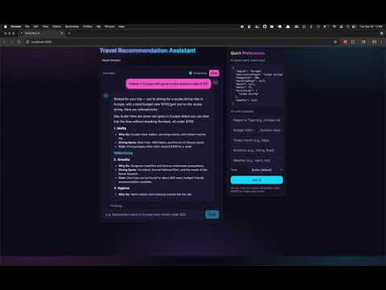

# Travel Recommendation System (MVP)

An AI-powered Next.js app that turns natural-language preferences into travel recommendations.

## Minimum requirements

- **Node.js**: 18.17.0 or newer (LTS 18 or 20 recommended)
- **Package manager**: one of
  - pnpm 8+ (recommended)
  - npm 9+
  - yarn 1.22+
- **OS**: macOS, Linux, or Windows

### Node version management

- This repo includes an `.nvmrc` (Node 18.17.0). If you use `nvm`:
  ```bash
  nvm use
  # or
  nvm install && nvm use
  ```
- If using `pnpm`, consider enabling Corepack (Node 18.19+ has it built-in):
  ```bash
  corepack enable
  ```

## Quickstart
```bash
pnpm i # or npm i / yarn
cp .env.local.example .env.local
# add OPENAI_API_KEY
pnpm dev
# open http://localhost:3000
```

## Demo

[](https://www.youtube.com/watch?v=I_Mmd9F5O8c)


## Running tests

This project uses Vitest.

- **Run the full test suite**
  ```
  pnpm test
  ```

- **Watch mode (reruns on change)**
  ```
  pnpm test:watch
  ```

- **Coverage report**
  ```
  pnpm test:cov
  ```

- **Filter tests by name or file**
  ```
  # by file
  pnpm vitest tests/tools.test.ts
  
  # by test name pattern
  pnpm vitest -t "parse preferences"
  ```

Tests live in `tests/` and target the parsing/util layers:
- `tests/parse.test.ts` – preference parsing and validation
- `tests/tools.test.ts` – helper utilities
- `tests/recommend.eval.ts` – light evaluation of recommendation formatting

Tip: If your editor integrates Vitest, run tests inline for faster iteration.

## AI integration overview

High-level architecture of how AI is used in this repo.

- **Endpoints**
  - `app/api/parse/route.ts` – converts freeform user text into a typed schema (Zod). Keeps responses minimal; no hallucinations.
  - `app/api/recommend/route.ts` – non-streaming recommendations. Calls OpenAI Chat Completions with a strict JSON schema, normalizes, then renders Markdown.
  - `app/api/recommend/stream/route.ts` – streaming variant. Yields recap first, then model tokens. Adds opportunistic links and a single image for the first destination.

- **Schemas & validation**
  - Zod schemas in `lib/schemas.ts` and per-mode schema selection via `lib/modeSchemas` ensure outputs match expected shapes.
  - Fallbacks and normalization clamp scores and dedupe highlights prior to rendering.

- **Model prompts**
  - System prompts include context-handling directives and a meta self-check to reduce fabrications.
  - Follow-up modes (e.g., climate/costs/flights/hotels/highlights/tips) tailor what to include and keep minimal answers terse.

- **Streaming vs non-streaming**
  - Streaming route pushes text chunks to the UI for fast feedback; non-streaming returns full Markdown at once.

- **Tone control**
  - User-selectable tone (e.g., surfer, friendly, formal, concise, enthusiastic, luxury, adventure, 90s-daria, hank-hill) is persisted to `localStorage` and sent to both recommend endpoints to influence phrasing and the recap lead.

- **Linking & media**
  - Default recommendations include helpful links (Google Flights, Booking.com, Google Hotels) and hotel names link to a relevant search.
  - An occasional image is embedded for the first destination.

- **Client rendering**

  - Conversation state, parsed preferences, streaming toggle, and tone persist via `localStorage`. Reset Session clears state.

- **Environment**
  - Requires `OPENAI_API_KEY` in `.env.local`. Optional `WEATHER_API_BASE` is supported for enrichment; falls back gracefully if absent.

## Follow‑up question thresholds

Before generating recommendations, the client performs a quick completeness check and may ask a single clarifying question if critical preference groups are missing. This logic lives in `app/page.tsx` inside `onSubmitInput()`.

- **Critical groups** (any that are missing will be counted):
  - **Region or destination type**: at least one of `region` or `destinationType` should be present.
  - **Target month**: `month` should be present.
  - **Budget or trip length**: at least one of `budgetUsd` or `durationDays` should be present.

- **Threshold to ask**
  - The app asks a clarifying question only when **all three groups are missing** (i.e., 3/3 missing). Otherwise, it proceeds to recommendations to avoid over‑prompting.

### Customizing the threshold
- Configurable via env and `lib/config.ts`:
  - Set `NEXT_PUBLIC_MIN_MISSING_GROUPS` in `.env.local` (1..3). Defaults to 3.
  - The value is read by `lib/config.ts` and used in `app/page.tsx`.
  ```env
  NEXT_PUBLIC_MIN_MISSING_GROUPS=2
  ```
- To ask more often: reduce the threshold (e.g., `missing.length >= 2`).
- To be stricter: keep at `>= 3` or require additional fields.
- You can also replace the generic prompt with targeted questions per missing group.
- **429 / rate limit**: Reduce test frequency; try again after a minute. Consider lower temperature or shorter outputs.
- **Streaming not working**: Toggle the Streaming checkbox in the header. Some proxies/extensions block server-sent streaming; try another browser.
- **Images not showing**: Network/extension may block `picsum.photos`. Replace with your own CDN or disable images in the API code. TODO Should me moved into env.local as config
- **TODO Tone not persisting**: Verify `localStorage.travel.form` and `localStorage.travel.tone` update when the Tone dropdown changes. Use Reset Session to clear and re-select.
- **Tests fail to find vitest**: Make sure deps are installed (`pnpm i`) and run `pnpm test`. For watch mode, use `pnpm test:watch`.